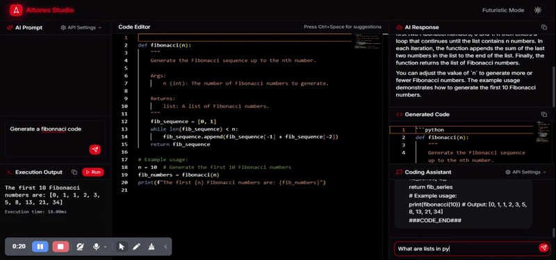

# 🚀 ATTORES STUDIO
A next-generation AI-powered code editor leveraging large language models to enhance the Python learning experience.

## 🔍 Overview
Attores Studio is an innovative code editing environment built with an AI-first approach, specifically designed to help users learn Python programming. By combining the power of modern language models with a clean, intuitive interface, Attores Studio creates an ideal environment for beginners and intermediate Python developers to write, understand, and improve their code.

## ✨ Demo


## 🛠️ Key Features

- **🤖 AI-Assisted Python Learning**: Get real-time explanations, hints, and suggestions as you code
- **💬 Natural Language Code Generation**: Transform concepts into working Python examples through conversational prompts
- **🔍 Interactive Code Breakdown**: Understand complex code blocks with line-by-line explanations
- **🐞 Guided Debugging**: Identify and fix errors with AI-powered assistance
- **🧠 Learning Path Integration**: Follow structured tutorials and exercises to build Python skills progressively
- **✅ Code Quality Feedback**: Receive suggestions to improve readability and efficiency of your Python code

## 💻 Tech Stack

- **Frontend**: React with TypeScript
- **Build System**: Vite
- **UI Components**:
  - Shadcn UI (built on Radix UI primitives)
  - Tailwind CSS with animations
- **Code Editor**: Monaco Editor
- **State Management & Data Fetching**:
  - React Query (TanStack Query)
  - React Hook Form
- **Form Validation**: Zod
- **Routing**: React Router
- **Data Visualization**: Recharts
- **Icons**: Lucide React
- **UI Enhancements**:
  - Sonner (toast notifications)
  - Embla Carousel
  - React Day Picker
  - React Resizable Panels
- **Development Tools**:
  - ESLint
  - TypeScript
  - PostCSS / Autoprefixer

## 🚀 Get Started

You can get started with Attores Studio in two ways:

### 🌐 Try It Online
Visit [attores.netlify.app](https://attores.netlify.app) and enter your own API key to start using the application immediately without any installation.

### 💾 Local Installation

```bash
# Clone the repository
git clone https://github.com/yourusername/attores-studio.git

# Navigate to the project directory
cd attores-studio

# Install dependencies
npm install

# Start the development server
npm run dev
```

## 📚 Documentation

Check out our [documentation](https://github.com/yourusername/attores-studio/wiki) for more detailed information on how to use Attores Studio to its full potential.

## 🤝 Contributing

Contributions are welcome! Feel free to submit a Pull Request or open an Issue.

## 🔮 Roadmap

- 📊 Advanced Python data structure visualizations
- 🌍 Support for additional programming languages
- 👥 Community-driven learning resources
- 📱 Mobile-responsive interface
- 🔌 Plugin ecosystem for extensibility

## 📝 License

MIT License

Copyright &copy; 2025 Dewashish Lambore

Permission is hereby granted, free of charge, to any person obtaining a copy
of this software and associated documentation files (the "Software"), to deal
in the Software without restriction, including without limitation the rights
to use, copy, modify, merge, publish, distribute, sublicense, and/or sell
copies of the Software, and to permit persons to whom the Software is
furnished to do so, subject to the following conditions:

The above copyright notice and this permission notice shall be included in all
copies or substantial portions of the Software.

THE SOFTWARE IS PROVIDED "AS IS", WITHOUT WARRANTY OF ANY KIND, EXPRESS OR
IMPLIED, INCLUDING BUT NOT LIMITED TO THE WARRANTIES OF MERCHANTABILITY,
FITNESS FOR A PARTICULAR PURPOSE AND NONINFRINGEMENT. IN NO EVENT SHALL THE
AUTHORS OR COPYRIGHT HOLDERS BE LIABLE FOR ANY CLAIM, DAMAGES OR OTHER
LIABILITY, WHETHER IN AN ACTION OF CONTRACT, TORT OR OTHERWISE, ARISING FROM,
OUT OF OR IN CONNECTION WITH THE SOFTWARE OR THE USE OR OTHER DEALINGS IN THE
SOFTWARE.

---

✨ **Attores Studio** - *Where AI meets Python to empower learners* ✨
